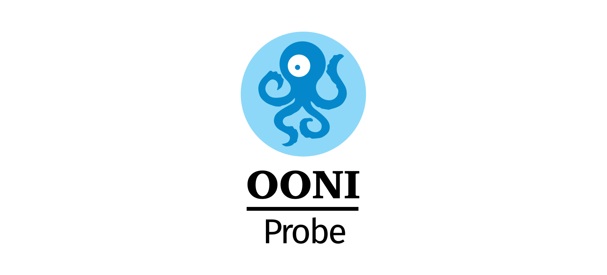

# OONI Probe Desktop

<p align="center">
  <a href="https://slack.openobservatory.org/">
        </a>

  <a href="https://github.com/ooni/probe/issues?q=label%3Aooni%2Fprobe-desktop">
    
  </a>

  <a href="https://twitter.com/intent/follow?screen_name=shields_io">
    </a>
</p>

OONI Probe is free and open source software designed to measure internet
censorship and other forms of network interference.

[](https://ooni.org)

[Click here to report a bug](https://github.com/ooni/probe/issues/new)

Other supported platforms: [iOS](https://github.com/ooni/probe-ios), [Desktop](https://github.com/ooni/probe-desktop), [CLI](https://github.com/ooni/probe-cli)

This is the desktop implementation of OONI Probe.

Our two primary target platforms are:

- macOS
- Windows > 7 (we may also support older versions, but not as primary targets)

Moreover, since it's written in electron, we plan on also supporting Linux desktop users.

For some background on the decision to use electron and the libraries we chose
to use, see: [Writing a modern cross-platform desktop
app](https://ooni.torproject.org/post/writing-a-modern-cross-platform-desktop-app/).

## Setup

In order to start hacking on this, we assume you have `node` and `yarn`
installed.

Then you can run:
```
yarn install
```

You will also need to have copied a compiled binary of `probe-cli` into the
directory for the platform you plan to do development on.

You can download them by running:

```bash
yarn run probe-cli
```

## Run app in development mode

To build and run a development mode electron instance run:

```bash
yarn run start
```

## Update the translations

* Save the strings from the canonical spreadsheet into `data/lang-en.csv`
* Run `$ node scripts/update-translations.js`
* Commit `data/lang-en.csv`, `lang/*.json` and `renderer/static/translations.js`
into git

## Build and sign macOS app

Obtain the development certificate and private key for our team (`YWCG8FZTLT`)
from another OONI developer who has access to it. They need to ensure they export
not only the certificate but also the related private key. You should receive a
password encrypted `.p12` file containing both. Just double click on this file and
provide the password to import the certificate and the key into your keyring. At
time point, dispose of the the `.p12` file using `rm -P`.

Create a `.env` file in the root directory with the following content:

```bash
GH_TOKEN=TOKEN
OONI_APPLEID=your@apple.id
OONI_APPLEIDPASS=XXXX
OONI_TEAMID=YWCG8FZTLT
```

where `TOKEN` is a [personal github token](https://github.com/settings/tokens/new)
with repository scope, `your@apple.id` is the Apple ID you are using as part of our
team, `XXXX` is a password specific application created by visiting
https://appleid.apple.com and logging in as `your@apple.id`, and
`YWCG8FZTLT` is the team ID used by OONI.

Then, run:

```bash
yarn install
yarn pack:mac
```

This will build `./dist/OONI Probe-$VERSION.dmg`.

## Build and sign an app on Windows

```bash
yarn install
yarn run pack:win
```

## Publish a release

Run:

```bash
yarn install
yarn run publish:mac
yarn run publish:win
```

**Important caveat** be sure to not push the tag for the upcoming release until
after the `yarn run publish` command has run successfully. If you do so users
of the OONI Probe Desktop app will get an error when they start the app because
the auto-update system will try to fetch the metadata associated with that tag.
